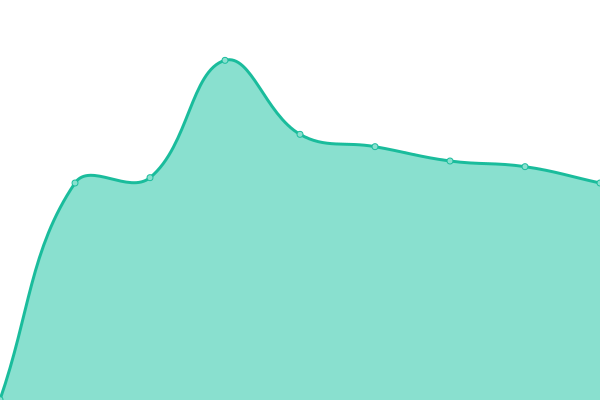
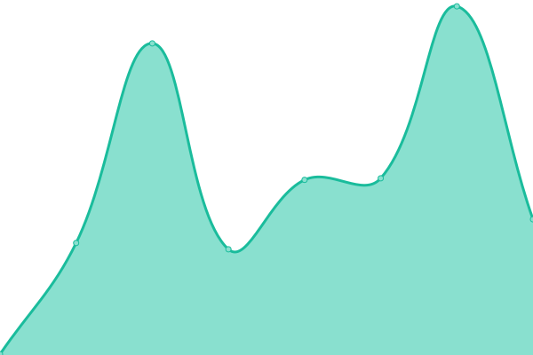

# 📈 Ascka's Status: <!--live status--> **🟧 Partial outage**

Welcome to Ascka's status page and uptime monitor, powered by [Upptime](https://upptime.js.org). You can visit the live status website [here](https://ashengstd.github.io/StatusPage/).

This repository tracks the real-time uptime and response times of Ascka's services using GitHub Actions, Issues, and Pages.

<!--start: status pages-->
<!-- This summary is generated by Upptime (https://github.com/upptime/upptime) -->
<!-- Do not edit this manually, your changes will be overwritten -->
<!-- prettier-ignore -->
| URL | Status | History | Response Time | Uptime |
| --- | ------ | ------- | ------------- | ------ |
|  [Serv00](https://ascka.serv00.net/) | 🟥 Down | [serv00.yml](https://github.com/ashengstd/StatusPage/commits/HEAD/history/serv00.yml) | 

 729ms
     
 | 

<a href="https://status.ascka.qzz.io/history/serv00">97.12%</a>
    

|  [Edge](https://config.ascka.qzz.io/ui/) | 🟥 Down | [edge.yml](https://github.com/ashengstd/StatusPage/commits/HEAD/history/edge.yml) | 

 3212ms
     
 | 

<a href="https://status.ascka.qzz.io/history/edge">0.00%</a>
    

|  [Blog](https://blog.tomorrowisinyourhands.fun/) | 🟩 Up | [blog.yml](https://github.com/ashengstd/StatusPage/commits/HEAD/history/blog.yml) | 

 160ms
     
 | 

<a href="https://status.ascka.qzz.io/history/blog">100.00%</a>
    

<!--end: status pages-->

[**Visit the live status website →**](https://ashengstd.github.io/StatusPage/)

## 📄 License

- Powered by: [Upptime](https://github.com/upptime/upptime)
- Code: [MIT](./LICENSE)
- Data in the `./history` directory: [Open Database License](https://opendatacommons.org/licenses/odbl/1-0/)
